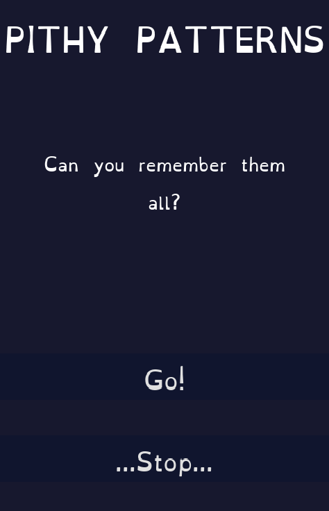
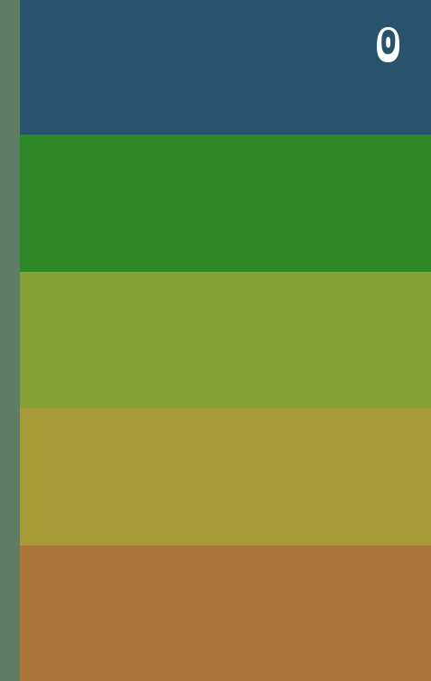

# BarClick

Follow the pattern, can you remember them all?

This is the idea behind BarClick - a Godot game with simple mechanics and multi-platform support!

The [Latest release](https://github.com/ArchiMoebius/barclick/releases){:target="_blank"} contains support for [Windows](/game/windows/barclick.x86_64.exe){:target="_blank"}, [Linux](/game/linux/barclick.x86_64){:target="_blank"}, and [Android](/game/android/barclick.apk){:target="_blank"}.

  <input checked="checked" id="__tabbed_3_1" name="__tabbed_3" type="radio">
  <input id="__tabbed_3_2" name="__tabbed_3" type="radio">
  <input id="__tabbed_3_3" name="__tabbed_3" type="radio">
  

    <label for="__tabbed_3_1">Play</label>
    <label for="__tabbed_3_2">Title Screen</label>
    <label for="__tabbed_3_3">Game Play</label>
  

  

    

      <iframe src="/game/html/index.html" width="480 " height="720">
      </iframe>
    

    

      
    

    

      
    

  

